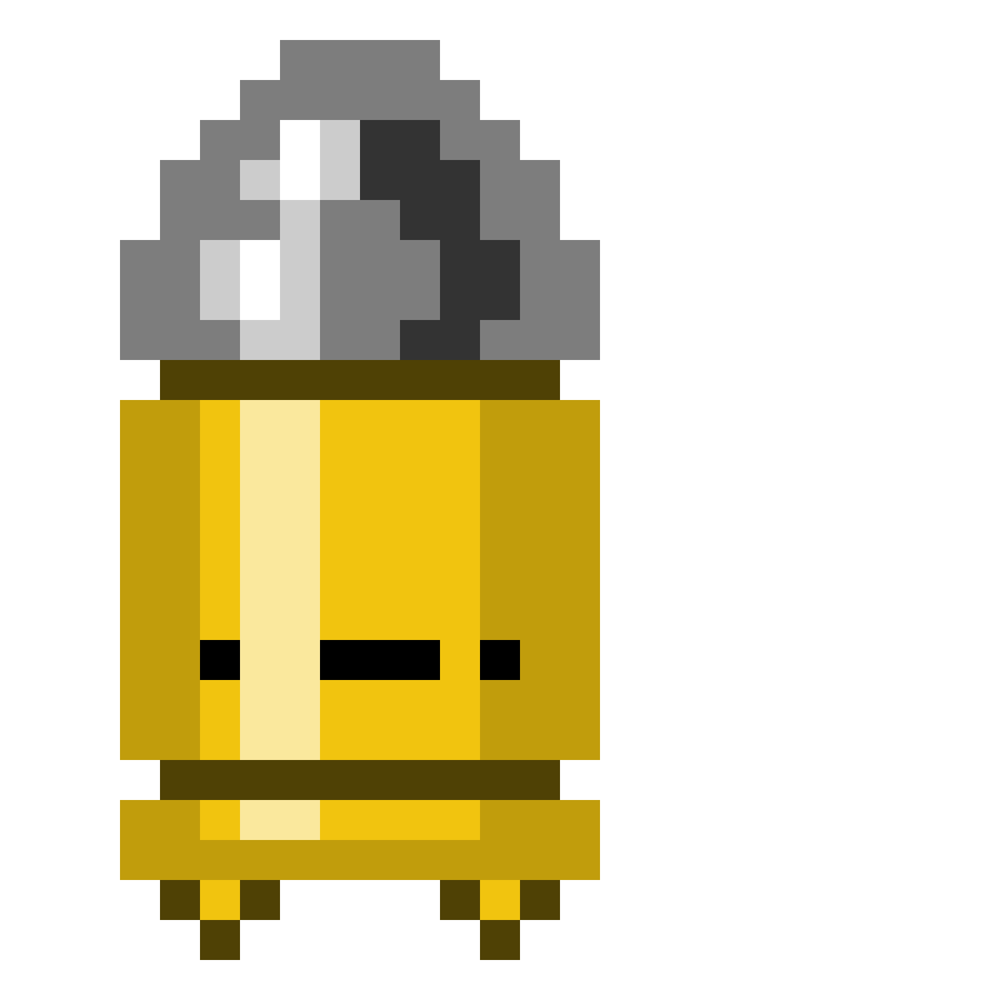

# Final-Game

## 📜 Descripción
Este es un videojuego 2D tipo plataformas desarrollado en **Godot Engine**.  
El jugador deberá explorar el primer mapa para recolectar las diferentes monedas para asi poder acceder al nivel siguiente, las monedas estan posicionadas de tal forma que se tiene que seguir un patron de recoleccion.
En el **primer nivel**, cada moneda recolectada aumenta la altura de salto del personaje.  
Cuando se alcance una cantidad específica de monedas, el jugador desbloqueará el acceso al **segundo nivel**, donde lo espera un **jefe final**. 

---

## ✨ Características
- 🎮 **Plataformas 2D**. 
- 🪙 Mecánica progresiva de salto: más monedas = más altura.  
- 🔓 Desbloqueo del segundo nivel al reunir la cantidad necesaria de monedas.  
- 👹 **Jefe final** en el nivel 2.  
- 🎨 Animaciones y físicas adaptadas al género plataforma.  
- 🛠 Desarrollado íntegramente en **Godot Engine**.  

---
## 🖼️ Assets

