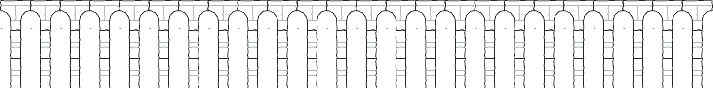
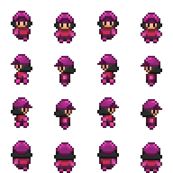
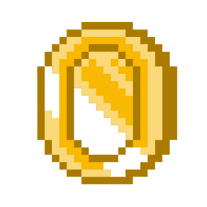
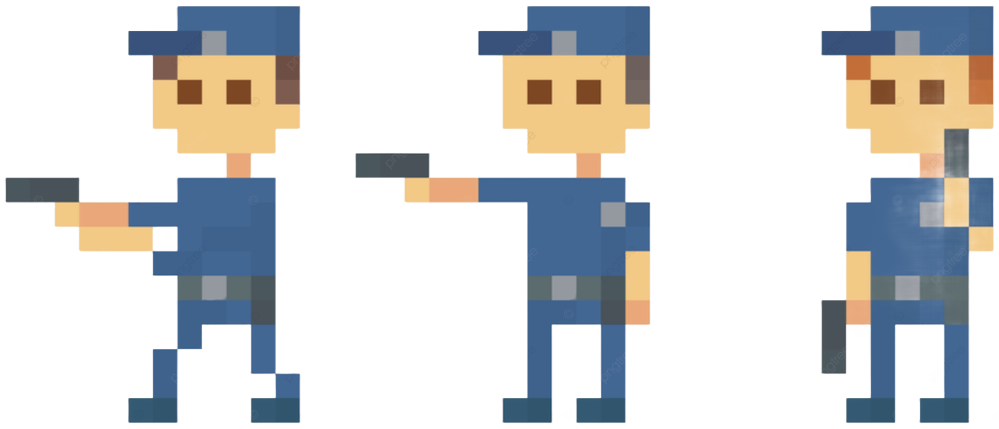
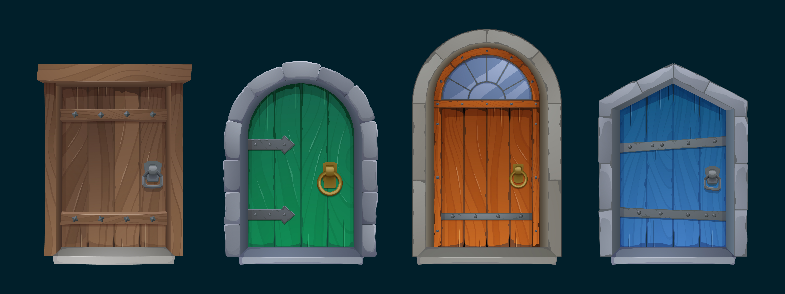

# Final-Game

## 📜 Descripción
Este es un videojuego 2D tipo plataformas desarrollado en **Godot Engine**.  
El jugador deberá explorar el primer mapa para recolectar las diferentes monedas para asi poder acceder al nivel siguiente, las monedas estan posicionadas de tal forma que se tiene que seguir un patron de recoleccion.
En el **primer nivel**, cada moneda recolectada aumenta la altura de salto del personaje.  
Cuando se alcance una cantidad específica de monedas, el jugador desbloqueará el acceso al **segundo nivel**, donde lo espera un **jefe final**. 

---

## ✨ Características
- 🎮 **Plataformas 2D**. 
- 🪙 Mecánica progresiva de salto: más monedas = más altura.  
- 🔓 Desbloqueo del segundo nivel al reunir la cantidad necesaria de monedas.  
- 👹 **Jefe final** en el nivel 2.  
- 🎨 Animaciones y físicas adaptadas al género plataforma.  
- 🛠 Desarrollado íntegramente en **Godot Engine**.  

---
## 🖼️ Assets

Este es el asset de la bala que dispara el policia.

---

Este es el asset del piso de los 2 niveles.

---

Este es el sprite del personaje donde salen sus animaciones.

---

Este es el sprite de la moneda el cual se debe tomar para acceder al sig nivel.

---

Este es el sprite del policia que sera el jefe final del juego.

---

De aqui sale el sprite de la puerta para acceder al nivel 2.

---

Es el background que tienen el primer nivel.

---

Es el background que tiene el segundo nivel.

---

Es el pasto donde es el area invencible.
