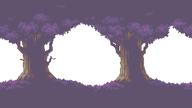

# Final-Game

## 📜 Descripción
Este es un videojuego 2D tipo plataformas desarrollado en **Godot Engine**.  
El jugador deberá explorar el primer mapa para recolectar las diferentes monedas para asi poder acceder al nivel siguiente, las monedas estan posicionadas de tal forma que se tiene que seguir un patron de recoleccion.
En el **primer nivel**, cada moneda recolectada aumenta la altura de salto del personaje.  
Cuando se alcance una cantidad específica de monedas, el jugador desbloqueará el acceso al **segundo nivel**, donde lo espera un **jefe final**. 

---

## ✨ Características
- 🎮 **Plataformas 2D**. 
- 🪙 Mecánica progresiva de salto: más monedas = más altura.  
- 🔓 Desbloqueo del segundo nivel al reunir la cantidad necesaria de monedas.  
- 👹 **Jefe final** en el nivel 2.  
- 🎨 Animaciones y físicas adaptadas al género plataforma.  
- 🛠 Desarrollado íntegramente en **Godot Engine**.  

---
## 🖼️ Assets


Este es el asset de la bala que dispara el policia.

---


Este es el asset del piso de los 2 niveles.

---


Este es el sprite del personaje donde salen sus animaciones.

---


Este es el sprite de la moneda el cual se debe tomar para acceder al sig nivel.

---


Este es el sprite del policia que sera el jefe final del juego.

---


De aqui sale el sprite de la puerta para acceder al nivel 2.

---



Es el background que tienen el primer nivel.

---


Es el background que tiene el segundo nivel.

---


Es el pasto donde es el area invencible.

---

## 👾Script

## Cargar el último nivel guardado en Godot

Este script, que extiende `Node`, carga el último nivel guardado usando el `SaveManager`.  
Si no existe un nivel guardado o el archivo no se encuentra, se carga por defecto `nivel_1.tscn`.

```gdscript
extends Node

func _ready():
	var save_data = SaveManager.load_game()
	if save_data.has("nivel_actual") and save_data["nivel_actual"] != "":
		var nivel = save_data["nivel_actual"]
		var ruta = "res://Niveles/%s.tscn" % nivel
		print("Intentando cargar nivel guardado:", nivel)
		print("Ruta:", ruta)

		if ResourceLoader.exists(ruta):
			get_tree().change_scene_to_file(ruta)
		else:
			print("No se encontró la escena guardada. Cargando nivel_1 por defecto.")
			get_tree().change_scene_to_file("res://Niveles/nivel_1.tscn")
	else:
		print("No hay nivel guardado. Cargando nivel_1 por defecto.")
		get_tree().change_scene_to_file("res://Niveles/nivel_1.tscn")

```

---

## Movimiento horizontal automático para un NPC o plataforma

Este script, que extiende `CharacterBody2D`, mueve el nodo horizontalmente dentro de un rango definido.  
Cuando alcanza el límite, invierte la dirección para crear un movimiento de ida y vuelta.

```gdscript
extends CharacterBody2D

@export var rango_movimiento = 200.0
@export var velocidad = 100.0

var posicion_inicial = Vector2.ZERO
var direccion = 1

func _ready():
	posicion_inicial = global_position

func _process(delta):
	global_position.x += velocidad * direccion * delta
	
	if abs(global_position.x - posicion_inicial.x) > rango_movimiento:
		direccion *= -1
```

## Puerta de cambio de nivel con requisito de monedas

Este script, que extiende `Area2D`, actúa como una puerta que lleva al jugador al siguiente nivel solo si tiene al menos 10 monedas.  
Si no cumple el requisito, muestra un mensaje en la consola.

```gdscript
extends Area2D

@export var nivel_siguiente: String = "res://Niveles/Nivel2.tscn"

func _on_body_entered(body):
	if body.is_in_group("jugador"):
		if body.monedas >= 10:
			get_tree().change_scene_to_file(nivel_siguiente)
		else:
			print("¡Necesitas 10 monedas para entrar!")
```

## Sistema de guardado y carga de partida

Este script, que extiende `Node`, gestiona el guardado y carga del progreso del jugador.  
Permite almacenar posición, monedas, salto, monedas recolectadas, nivel actual y estado de victoria.  
Si `victory` es `true`, elimina el archivo de guardado.

```gdscript
extends Node

var save_path := "user://savegame.save"

func save_game(player_position: Vector2, monedas: int, salto: float, collected_coins: Array, victory := false, nivel_actual := ""):
	if victory:
		if FileAccess.file_exists(save_path):
			var dir = DirAccess.open("user://")
			if dir:
				dir.remove(save_path.get_file())
		return

	var data = {
		"position": player_position,
		"monedas": monedas,
		"salto": salto,
		"collected_coins": collected_coins,
		"victory": victory,
		"nivel_actual": nivel_actual
	}

	var file = FileAccess.open(save_path, FileAccess.WRITE)
	if file:
		file.store_var(data)
		file.close()
	else:
		print("No se pudo abrir el archivo para guardar")

func load_game() -> Dictionary:
	if not FileAccess.file_exists(save_path):
		return {}
	var file = FileAccess.open(save_path, FileAccess.READ)
	if file:
		var data = file.get_var()
		file.close()
		return data
	return {}
```

## Script principal del jugador

Este script, que extiende `CharacterBody2D`, controla el movimiento, animaciones, recolección de monedas y carga/guardado de progreso del jugador.  
Incluye soporte para plataformas móviles, aumento de salto por monedas recolectadas y detección de plataformas blindadas.

```gdscript
extends CharacterBody2D

@export var velocidad: float = 2000.0
@export var gravedad: float = 980.0
@export var salto: float = -750.0

var monedas: int = 0
var collected_coins: Array = []
var label_monedas: Label
var animated_sprite: AnimatedSprite2D

func _ready():
	label_monedas = get_tree().current_scene.get_node("UI/ContadorMonedas")
	animated_sprite = $AnimatedSprite2D

	var save_data = SaveManager.load_game()
	if save_data.size() > 0:
		var nivel_guardado = save_data.get("nivel_actual", "")
		var nivel_actual = get_tree().current_scene.name
		if nivel_guardado == nivel_actual:
			global_position = save_data["position"]
			monedas = save_data["monedas"]
			salto = save_data["salto"]
			collected_coins = save_data["collected_coins"]
			label_monedas.text = str(monedas)

			for coin in get_tree().get_nodes_in_group("Coins"):
				if coin.name in collected_coins:
					coin.queue_free()

			if save_data.has("victory") and save_data["victory"]:
				get_tree().current_scene.get_node("MensajeFinal").visible = true
		else:
			monedas = 0
			collected_coins = []
			label_monedas.text = "0"

func _physics_process(delta):
	if not is_on_floor():
		velocity.y += gravedad * delta
	else:
		velocity.y = 0.0

	if global_position.y > 1000:
		get_tree().reload_current_scene()

	var direccion = Vector2.ZERO
	if Input.is_action_pressed("ui_right"):
		direccion.x += 1
		animated_sprite.play("caminar_derecha")
	elif Input.is_action_pressed("ui_left"):
		direccion.x -= 1
		animated_sprite.play("caminar_izquierda")
	else:
		animated_sprite.play("idle")

	var plataforma_velocity = Vector2.ZERO
	if is_on_floor():
		var colision = get_slide_collision(0)
		if colision != null and colision.get_collider() is CharacterBody2D:
			var plataforma = colision.get_collider() as CharacterBody2D
			plataforma_velocity = plataforma.velocity

	velocity.x = direccion.x * velocidad + plataforma_velocity.x

	if Input.is_action_just_pressed("ui_accept") and is_on_floor():
		velocity.y = salto

	move_and_slide()

func aumentar_salto():
	salto *= 1.1
	print("Nuevo valor de salto:", salto)

func agregar_moneda(coin_node):
	monedas += 1
	label_monedas.text = str(monedas)
	collected_coins.append(coin_node.name)
	aumentar_salto()
	
func esta_en_plataforma_blindada() -> bool:
	if is_on_floor():
		var colision = get_slide_collision(0)
		if colision != null and colision.get_collider().is_in_group("plataforma_blindada"):
			return true
	return false

func _notification(what):
	if what == NOTIFICATION_WM_CLOSE_REQUEST:
		SaveManager.save_game(
			global_position,
			monedas,
			salto,
			collected_coins,
			false,
			get_tree().current_scene.name  
		)
		get_tree().quit()
```

## Script de moneda recolectable

Este script, que extiende `Area2D`, representa una moneda dentro del juego.  
Cuando el jugador entra en contacto con ella, emite la señal `moneda_agarrada` y luego se elimina de la escena.

```gdscript
extends Area2D

signal moneda_agarrada

func _on_body_entered(body):
	if body.is_in_group("jugador"):
		moneda_agarrada.emit(self)
		queue_free()
```

## Bala enemiga con detección de plataformas blindadas

Este script, que extiende `Area2D`, controla una bala enemiga que se mueve horizontalmente.  
Si impacta al jugador y este **no** está en una plataforma blindada, reinicia la escena.  
En caso de estar protegido, no causa daño. La bala se elimina después del impacto.

```gdscript
extends Area2D

var velocidad = -2000  

func _process(delta):
	position.x += velocidad * delta  

func _on_body_entered(body):
	if body is CharacterBody2D:
		if body.has_method("esta_en_plataforma_blindada") and body.esta_en_plataforma_blindada():
			print("Protegido por plataforma blindada. No hay daño.")
		else:
			get_tree().reload_current_scene()
		call_deferred("queue_free")
```

---

## Generador de balas y finalización del juego

Este script, que extiende `Area2D`, actúa como un generador de balas mediante un `Timer`.  
Cuando el jugador entra en contacto con este nodo, se muestra el mensaje final y se guarda el estado de victoria en el sistema de guardado.

```gdscript
extends Area2D

@export var bala_escena: PackedScene
@onready var spawn_point = $SpawnPoint
@onready var timer = $Timer

func _ready():
	timer.start()
	timer.timeout.connect(_on_Timer_timeout)

func _on_Timer_timeout():
	var nueva_bala = bala_escena.instantiate()
	nueva_bala.position = spawn_point.global_position
	get_tree().current_scene.add_child(nueva_bala)

func _on_body_entered(body: Node2D) -> void:
	if body is CharacterBody2D:
		call_deferred("queue_free")
		get_tree().current_scene.get_node("MensajeFinal").visible = true
		SaveManager.save_game(
			body.global_position,
			body.monedas,
			body.salto,
			body.collected_coins,
			true 
		)
```

---
